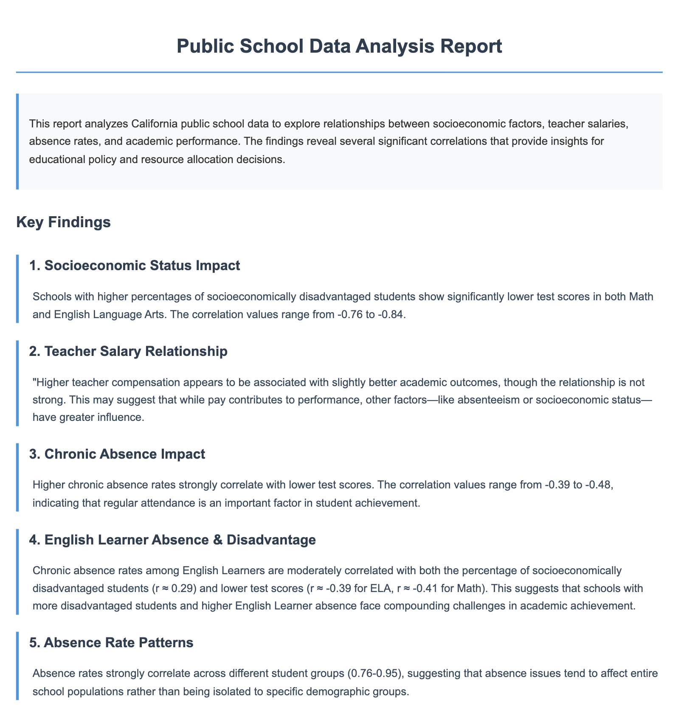

# Public School Data Analysis

This project analyzes California public school data including expenditures, salaries, test scores, and chronic absence rates to identify factors that may influence student academic performance.

## Key Findings

From our correlation analysis:

1. **Socioeconomic Impact**: Strong negative correlation between the percentage of socioeconomically disadvantaged students and test scores
2. **Teacher Salary Effect**: Modest positive correlation between teacher salaries and test scores
3. **Chronic Absence Impact**: Negative correlation between absence rates and test scores
4. **Consistent Patterns**: Salary structures and absence rates show strong internal correlations across categories

## Setup and Running the Analysis

1. **Install Dependencies**
   ```bash
   pip install pandas numpy matplotlib scikit-learn seaborn
   ```

2. **Run the Analysis**
   ```bash
   # Make the script executable if needed
   chmod +x run.sh
   
   # Run the basic analysis
   ./run.sh
   
   # Run with HTML report
   ./run.sh --html-report
   ```

3. **Output**
   All visualizations are saved to the `output` directory. HTML reports can be viewed in any web browser.

   The project uses Matplotlib's 'Agg' backend, which is a non-interactive backend that generates visualizations without requiring a display. This makes the code run smoothly in environments without a GUI, like remote servers or CI pipelines.

## HTML Report Preview

Below is a preview of the HTML report generated by the analysis:



You can include multiple screenshots to showcase different aspects of the report:


*Correlation heatmap showing relationships between key variables*


*Analysis of factors influencing test scores*

The interactive HTML report contains all visualizations and findings in a web-friendly format. To generate and view the full report:

1. Run the analysis with the HTML report flag: `./run.sh --html-report`
2. Open the generated file at `output/school_data_report.html` in any web browser

## Data Variables

- **CDSCODE**: Unique identifier for California schools
- **DSAL, STSAL**: District and State Salary (Normalized)
- **BTCHSAL, MTCHSAL, HTCHSAL**: Beginning, Mid-career, and High-level Teacher Salary (Normalized)
- **SELA_Y2, SMATH_Y2**: State English Language Arts and Mathematics Test Scores
- **DELA_Y2, DMATH_Y2**: District English Language Arts and Mathematics Test Scores
- **PERSD**: Percentage of Socioeconomically Disadvantaged Students
- **RALL, REL, RSED**: Chronic Absence Rate for All Students, English Learners, and Socioeconomically Disadvantaged Students

## Visualization Examples

The analysis produces several informative visualizations:

1. **Correlation Matrix**: A heatmap showing relationships between all variables
2. **Test Score Relationships**: Scatter plots showing connections between teacher salaries, absence rates, and test scores
3. **SED Impact Analysis**: Bar charts comparing test scores across different socioeconomic groups
4. **Variable Distributions**: Histograms showing the distribution of key metrics
5. **SED-Test Score Relationship**: Detailed analysis of the relationship between socioeconomic status and academic performance

## Insights for Educational Policy

These findings may help inform policy decisions related to:
- Resource allocation to schools with high socioeconomically disadvantaged populations
- Teacher compensation strategies
- Attendance improvement initiatives
- Targeted interventions for specific student populations

**Data period: 2022-23**